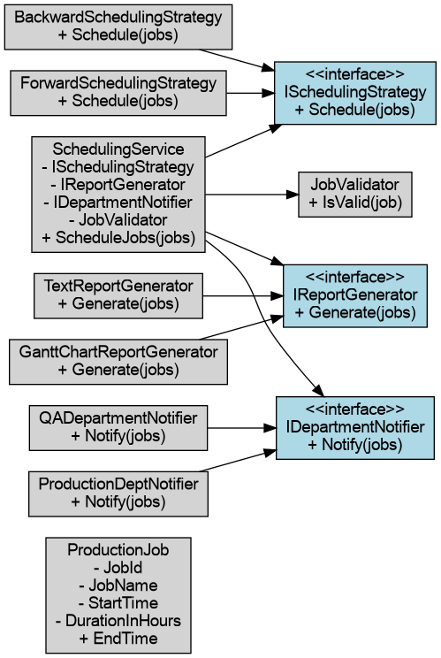

### **SOLID Principles Covered:**

1. **S** – **Single Responsibility**: Each class has one responsibility.
2. **O** – **Open/Closed**: Code is open for extension but closed for modification.
3. **L** – **Liskov Substitution**: Subtypes can replace their base types without breaking the app.
4. **I** – **Interface Segregation**: Clients only implement interfaces they need.
5. **D** – **Dependency Inversion**: High-level modules do not depend on low-level ones; both depend on abstractions.

---

### **C# Code Sample**

```csharp
using System;
using System.Collections.Generic;

// 1. SRP - Each class has one responsibility

// Represents a customer order
public class Order
{
    public int OrderId { get; set; }
    public List<string> Items { get; set; } = new();
    public decimal TotalAmount { get; set; }
}

// Responsible only for validating orders
public class OrderValidator
{
    public bool Validate(Order order)
    {
        return order.Items.Count > 0 && order.TotalAmount > 0;
    }
}

// 2. OCP - Can add new payment methods without modifying existing ones

public interface IPaymentProcessor
{
    void ProcessPayment(Order order);
}

public class CreditCardPaymentProcessor : IPaymentProcessor
{
    public void ProcessPayment(Order order)
    {
        Console.WriteLine("Processing credit card payment...");
    }
}

public class PayPalPaymentProcessor : IPaymentProcessor
{
    public void ProcessPayment(Order order)
    {
        Console.WriteLine("Processing PayPal payment...");
    }
}

// 3. LSP - Subclasses should be usable via their base class/interface

public interface IInvoiceGenerator
{
    void Generate(Order order);
}

public class PdfInvoiceGenerator : IInvoiceGenerator
{
    public void Generate(Order order)
    {
        Console.WriteLine("Generating PDF invoice...");
    }
}

public class EmailInvoiceGenerator : IInvoiceGenerator
{
    public void Generate(Order order)
    {
        Console.WriteLine("Sending invoice via email...");
    }
}

// 4. ISP - Interfaces are split, no class is forced to implement unnecessary methods

public interface INotifier
{
    void NotifyCustomer(Order order);
}

public class EmailNotifier : INotifier
{
    public void NotifyCustomer(Order order)
    {
        Console.WriteLine("Sending email notification to customer...");
    }
}

// 5. DIP - High-level modules depend on abstractions, not concrete implementations

public class OrderService
{
    private readonly IPaymentProcessor _paymentProcessor;
    private readonly IInvoiceGenerator _invoiceGenerator;
    private readonly INotifier _notifier;
    private readonly OrderValidator _validator;

    public OrderService(
        IPaymentProcessor paymentProcessor,
        IInvoiceGenerator invoiceGenerator,
        INotifier notifier,
        OrderValidator validator)
    {
        _paymentProcessor = paymentProcessor;
        _invoiceGenerator = invoiceGenerator;
        _notifier = notifier;
        _validator = validator;
    }

    public void ProcessOrder(Order order)
    {
        if (!_validator.Validate(order))
        {
            Console.WriteLine("Order validation failed.");
            return;
        }

        _paymentProcessor.ProcessPayment(order);
        _invoiceGenerator.Generate(order);
        _notifier.NotifyCustomer(order);

        Console.WriteLine("Order processed successfully.");
    }
}

// Main program to tie everything together
public class Program
{
    public static void Main()
    {
        var order = new Order
        {
            OrderId = 1,
            Items = new List<string> { "Laptop", "Mouse" },
            TotalAmount = 1500m
        };

        // Use constructor injection to pass dependencies
        var orderService = new OrderService(
            new CreditCardPaymentProcessor(),
            new PdfInvoiceGenerator(),
            new EmailNotifier(),
            new OrderValidator()
        );

        orderService.ProcessOrder(order);
    }
}
```

---

### **How Each SOLID Principle is Applied:**

| Principle | Applied Through                                                                                            |
| --------- | ---------------------------------------------------------------------------------------------------------- |
| **S**     | `OrderValidator`, `OrderService`, `EmailNotifier`, `PdfInvoiceGenerator` each handle a single task.        |
| **O**     | New payment methods (e.g., ApplePayProcessor) can be added without modifying `OrderService`.               |
| **L**     | `PdfInvoiceGenerator` and `EmailInvoiceGenerator` can replace `IInvoiceGenerator` safely.                  |
| **I**     | Separate interfaces like `IPaymentProcessor`, `INotifier`, `IInvoiceGenerator` prevent bloated interfaces. |
| **D**     | `OrderService` depends on abstractions, not concrete classes.                                              |

---

Great choice — **Planning and Scheduling** is a core module in many ERP systems, especially in **manufacturing, logistics, and services**.

Let me show you an adapted **SOLID-compliant C# example** tailored to this domain.

---

## **ERP Scenario: Planning & Scheduling Module**

### **Use Case**:

We’re building a component of an ERP system responsible for scheduling **production jobs**. The system:

* Validates job schedules.
* Supports multiple scheduling strategies (e.g., Forward Scheduling, Backward Scheduling).
* Generates reports (e.g., Gantt charts, job lists).
* Notifies relevant departments (e.g., production, QA).
* Uses abstractions for all key operations (SOLID principles in action).

---

## **C# Code Sample for Planning & Scheduling**

```csharp
using System;
using System.Collections.Generic;

// ========== 1. SRP (Single Responsibility Principle) ==========

public class ProductionJob
{
    public int JobId { get; set; }
    public string JobName { get; set; }
    public DateTime StartTime { get; set; }
    public int DurationInHours { get; set; }
    public DateTime EndTime => StartTime.AddHours(DurationInHours);
}

// Only validates job scheduling rules
public class JobValidator
{
    public bool IsValid(ProductionJob job)
    {
        return job.DurationInHours > 0 && !string.IsNullOrEmpty(job.JobName);
    }
}

// ========== 2. OCP (Open/Closed Principle) ==========

public interface ISchedulingStrategy
{
    void Schedule(List<ProductionJob> jobs);
}

public class ForwardSchedulingStrategy : ISchedulingStrategy
{
    public void Schedule(List<ProductionJob> jobs)
    {
        DateTime currentTime = DateTime.Now;
        foreach (var job in jobs)
        {
            job.StartTime = currentTime;
            currentTime = job.EndTime;
        }
        Console.WriteLine("Jobs scheduled using Forward Scheduling.");
    }
}

public class BackwardSchedulingStrategy : ISchedulingStrategy
{
    public void Schedule(List<ProductionJob> jobs)
    {
        DateTime endTime = DateTime.Now.AddHours(24); // Assume deadline
        for (int i = jobs.Count - 1; i >= 0; i--)
        {
            jobs[i].StartTime = endTime.AddHours(-jobs[i].DurationInHours);
            endTime = jobs[i].StartTime;
        }
        Console.WriteLine("Jobs scheduled using Backward Scheduling.");
    }
}

// ========== 3. LSP (Liskov Substitution Principle) ==========

public interface IReportGenerator
{
    void Generate(List<ProductionJob> jobs);
}

public class GanttChartReportGenerator : IReportGenerator
{
    public void Generate(List<ProductionJob> jobs)
    {
        Console.WriteLine("Generating Gantt chart report...");
    }
}

public class TextReportGenerator : IReportGenerator
{
    public void Generate(List<ProductionJob> jobs)
    {
        Console.WriteLine("Generating plain text job list...");
    }
}

// ========== 4. ISP (Interface Segregation Principle) ==========

public interface IDepartmentNotifier
{
    void Notify(List<ProductionJob> jobs);
}

public class ProductionDepartmentNotifier : IDepartmentNotifier
{
    public void Notify(List<ProductionJob> jobs)
    {
        Console.WriteLine("Notifying Production Department...");
    }
}

public class QADepartmentNotifier : IDepartmentNotifier
{
    public void Notify(List<ProductionJob> jobs)
    {
        Console.WriteLine("Notifying Quality Assurance Department...");
    }
}

// ========== 5. DIP (Dependency Inversion Principle) ==========

public class SchedulingService
{
    private readonly ISchedulingStrategy _schedulingStrategy;
    private readonly IReportGenerator _reportGenerator;
    private readonly IDepartmentNotifier _notifier;
    private readonly JobValidator _validator;

    public SchedulingService(
        ISchedulingStrategy schedulingStrategy,
        IReportGenerator reportGenerator,
        IDepartmentNotifier notifier,
        JobValidator validator)
    {
        _schedulingStrategy = schedulingStrategy;
        _reportGenerator = reportGenerator;
        _notifier = notifier;
        _validator = validator;
    }

    public void ScheduleJobs(List<ProductionJob> jobs)
    {
        foreach (var job in jobs)
        {
            if (!_validator.IsValid(job))
            {
                Console.WriteLine($"Invalid job: {job.JobName}");
                return;
            }
        }

        _schedulingStrategy.Schedule(jobs);
        _reportGenerator.Generate(jobs);
        _notifier.Notify(jobs);
        Console.WriteLine("Scheduling complete.");
    }
}

// ========== Main Execution ==========

public class Program
{
    public static void Main()
    {
        var jobs = new List<ProductionJob>
        {
            new ProductionJob { JobId = 1, JobName = "Cutting", DurationInHours = 3 },
            new ProductionJob { JobId = 2, JobName = "Assembly", DurationInHours = 5 },
            new ProductionJob { JobId = 3, JobName = "Quality Check", DurationInHours = 2 }
        };

        var schedulingService = new SchedulingService(
            new ForwardSchedulingStrategy(),
            new GanttChartReportGenerator(),
            new ProductionDepartmentNotifier(),
            new JobValidator()
        );

        schedulingService.ScheduleJobs(jobs);
    }
}
```

---

## **How SOLID Principles Are Applied (ERP Style)**

| Principle | Applied Through                                                                                                    |
| --------- | ------------------------------------------------------------------------------------------------------------------ |
| **SRP**   | `ProductionJob`, `JobValidator`, `SchedulingService` have single, distinct roles.                                  |
| **OCP**   | Easy to add new scheduling strategies (e.g., Capacity-Based Scheduling).                                           |
| **LSP**   | Any report generator can be substituted via `IReportGenerator`.                                                    |
| **ISP**   | Notifiers only implement what they need — no bloated interfaces.                                                   |
| **DIP**   | `SchedulingService` depends on interfaces (`ISchedulingStrategy`, `IReportGenerator`, etc.), not concrete classes. |

---

## Want to Extend This?

Here are a few ideas if you'd like to expand this:

* Add **machine/resource constraints** to scheduling.
* Introduce **job priorities**.
* Integrate with **calendar APIs** or **capacity planning**.
* Add **unit tests** to validate SRP and DIP compliance.

---

## 1. **UML Class Diagram (in Markdown format with PlantUML syntax)**

This diagram captures the class structure and interface relationships in your **ERP Planning & Scheduling** example.

You can render this using a PlantUML renderer (e.g., [https://plantuml.com/live](https://plantuml.com/live) or VS Code with a PlantUML plugin).

### **PlantUML Code:**

```plantuml
@startuml
title ERP Planning & Scheduling - SOLID Example

' ===== Classes =====
class ProductionJob {
  - int JobId
  - string JobName
  - DateTime StartTime
  - int DurationInHours
  + DateTime EndTime
}

class JobValidator {
  + bool IsValid(ProductionJob job)
}

class SchedulingService {
  - ISchedulingStrategy _schedulingStrategy
  - IReportGenerator _reportGenerator
  - IDepartmentNotifier _notifier
  - JobValidator _validator
  + void ScheduleJobs(List<ProductionJob> jobs)
}

' ===== Interfaces =====
interface ISchedulingStrategy {
  + void Schedule(List<ProductionJob> jobs)
}

interface IReportGenerator {
  + void Generate(List<ProductionJob> jobs)
}

interface IDepartmentNotifier {
  + void Notify(List<ProductionJob> jobs)
}

' ===== Implementations =====
class ForwardSchedulingStrategy {
  + void Schedule(List<ProductionJob> jobs)
}

class BackwardSchedulingStrategy {
  + void Schedule(List<ProductionJob> jobs)
}

class GanttChartReportGenerator {
  + void Generate(List<ProductionJob> jobs)
}

class TextReportGenerator {
  + void Generate(List<ProductionJob> jobs)
}

class ProductionDepartmentNotifier {
  + void Notify(List<ProductionJob> jobs)
}

class QADepartmentNotifier {
  + void Notify(List<ProductionJob> jobs)
}

' ===== Relationships =====
SchedulingService --> ISchedulingStrategy
SchedulingService --> IReportGenerator
SchedulingService --> IDepartmentNotifier
SchedulingService --> JobValidator

ForwardSchedulingStrategy ..|> ISchedulingStrategy
BackwardSchedulingStrategy ..|> ISchedulingStrategy

GanttChartReportGenerator ..|> IReportGenerator
TextReportGenerator ..|> IReportGenerator

ProductionDepartmentNotifier ..|> IDepartmentNotifier
QADepartmentNotifier ..|> IDepartmentNotifier

@enduml
```





---

## **ASCII UML Diagram for ERP Planning & Scheduling System**

```
+---------------------+
|   ProductionJob     |
+---------------------+
| - JobId             |
| - JobName           |
| - StartTime         |
| - DurationInHours   |
| + EndTime           |
+---------------------+

+---------------------+       +-------------------------+
|    JobValidator     |       |  SchedulingService      |
+---------------------+       +-------------------------+
| + IsValid(job)      |       | - ISchedulingStrategy   |
|                     |       | - IReportGenerator      |
|                     |       | - IDepartmentNotifier   |
|                     |       | - JobValidator          |
|                     |       | + ScheduleJobs(jobs)    |
+---------------------+       +-------------------------+
                                        |
          +-----------------------------+----------------------------+
          |                             |                            |
          v                             v                            v

+--------------------------+   +------------------------+   +--------------------------+
|   ISchedulingStrategy    |   |   IReportGenerator     |   |   IDepartmentNotifier    |
+--------------------------+   +------------------------+   +--------------------------+
| + Schedule(jobs)         |   | + Generate(jobs)       |   | + Notify(jobs)           |
+--------------------------+   +------------------------+   +--------------------------+
          ^                             ^                            ^
          |                             |                            |
+----------------------------+  +----------------------------+  +------------------------------+
| ForwardSchedulingStrategy  |  | GanttChartReportGenerator |  | ProductionDepartmentNotifier |
+----------------------------+  +----------------------------+  +------------------------------+
| + Schedule(jobs)           |  | + Generate(jobs)          |  | + Notify(jobs)               |
+----------------------------+  +----------------------------+  +------------------------------+

+-----------------------------+
| BackwardSchedulingStrategy |
+-----------------------------+
| + Schedule(jobs)           |
+-----------------------------+

+--------------------------+
| TextReportGenerator      |
+--------------------------+
| + Generate(jobs)         |
+--------------------------+

+------------------------------+
| QADepartmentNotifier         |
+------------------------------+
| + Notify(jobs)               |
+------------------------------+
```

---

### Relationships Summary

* **`SchedulingService`** depends on:

  * `ISchedulingStrategy`
  * `IReportGenerator`
  * `IDepartmentNotifier`
  * `JobValidator`

* **Interfaces**:

  * `ISchedulingStrategy` has 2 implementations: `ForwardSchedulingStrategy`, `BackwardSchedulingStrategy`
  * `IReportGenerator` has 2 implementations: `GanttChartReportGenerator`, `TextReportGenerator`
  * `IDepartmentNotifier` has 2 implementations: `ProductionDepartmentNotifier`, `QADepartmentNotifier`

---

### Usage Tips

* This diagram is designed for **text-based tools**, **markdown viewers**, or **command-line sharing**.
* You can paste it into documentation, wikis (like Confluence or Notion), or directly in source code comments.

---

## 2. **Unit Tests (using xUnit or NUnit)**

These tests verify core behaviors of the system using **xUnit** syntax, which is commonly used in C# development. You can adapt to NUnit if needed.

### Prerequisites:

* Create a **Test Project** in .NET (e.g., using `dotnet new xunit`).
* Add references to your main project.

---

### **SchedulingServiceTests.cs**

```csharp
using System;
using System.Collections.Generic;
using Xunit;
using Moq;

public class SchedulingServiceTests
{
    [Fact]
    public void ScheduleJobs_Should_ScheduleJobs_WhenValid()
    {
        // Arrange
        var jobs = new List<ProductionJob>
        {
            new ProductionJob { JobId = 1, JobName = "Cut", DurationInHours = 2 }
        };

        var mockStrategy = new Mock<ISchedulingStrategy>();
        var mockReporter = new Mock<IReportGenerator>();
        var mockNotifier = new Mock<IDepartmentNotifier>();
        var validator = new JobValidator();

        var service = new SchedulingService(mockStrategy.Object, mockReporter.Object, mockNotifier.Object, validator);

        // Act
        service.ScheduleJobs(jobs);

        // Assert
        mockStrategy.Verify(x => x.Schedule(jobs), Times.Once);
        mockReporter.Verify(x => x.Generate(jobs), Times.Once);
        mockNotifier.Verify(x => x.Notify(jobs), Times.Once);
    }

    [Fact]
    public void ScheduleJobs_Should_NotSchedule_WhenJobInvalid()
    {
        // Arrange
        var jobs = new List<ProductionJob>
        {
            new ProductionJob { JobId = 1, JobName = "", DurationInHours = 0 }
        };

        var mockStrategy = new Mock<ISchedulingStrategy>();
        var mockReporter = new Mock<IReportGenerator>();
        var mockNotifier = new Mock<IDepartmentNotifier>();
        var validator = new JobValidator();

        var service = new SchedulingService(mockStrategy.Object, mockReporter.Object, mockNotifier.Object, validator);

        // Act
        service.ScheduleJobs(jobs);

        // Assert
        mockStrategy.Verify(x => x.Schedule(It.IsAny<List<ProductionJob>>()), Times.Never);
        mockReporter.Verify(x => x.Generate(It.IsAny<List<ProductionJob>>()), Times.Never);
        mockNotifier.Verify(x => x.Notify(It.IsAny<List<ProductionJob>>()), Times.Never);
    }
}
```

---

### Test Summary:

| Test                                             | What it Verifies                                          |
| ------------------------------------------------ | --------------------------------------------------------- |
| `ScheduleJobs_Should_ScheduleJobs_WhenValid`     | Happy path where all dependencies are called correctly.   |
| `ScheduleJobs_Should_NotSchedule_WhenJobInvalid` | Invalid job prevents scheduling, reporting, or notifying. |

---

## Summary

You now have:

* A UML class diagram of the Planning & Scheduling architecture.
* Unit tests validating SRP, DIP, and OCP behavior.
* A structure that is extensible for real ERP use cases (e.g., constraint-based scheduling, job dependencies, resource loading).

Would you like:

* Integration tests or mocks for scheduling algorithms?
* A diagram export (PNG/SVG)?
* Help turning this into a REST API (e.g., with ASP.NET Core)?


